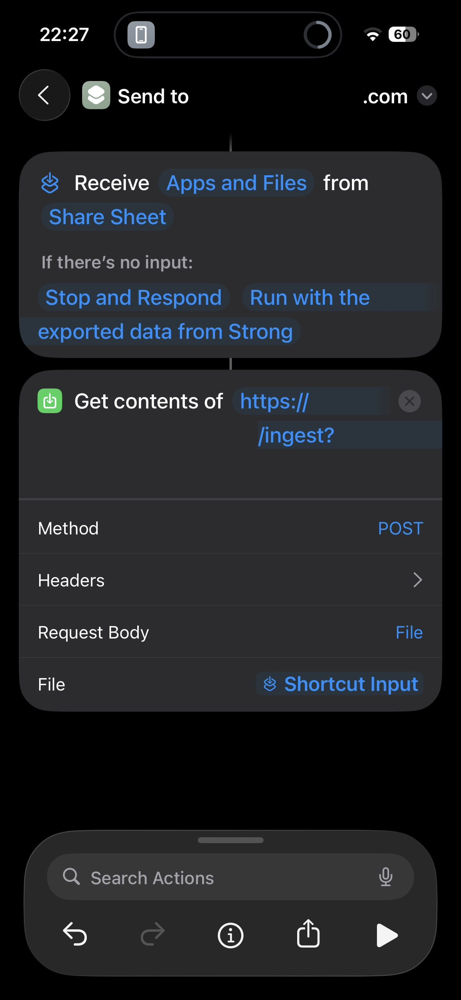

# strong-statistics

Self‑hosted strength‑training analytics for **Strong** app exports. Import your CSV, see PRs, volume trends, rep ranges, and workout history — all stored locally in SQLite.


---

## 🚀 TL;DR (self‑host)

```bash
git clone https://github.com/DaKheera47/strong-statistics.git
cd strong-statistics
cp .env.example .env   # set INGEST_TOKEN to a long random string
docker compose up -d
```

Then open:

* Dashboard → [http://localhost:8000/](http://localhost:8000/)

---

## ⚙️ Configuration (minimal)

Edit `.env` before first run:

| Variable       | Required | Default | What it does                                  |
| -------------- | -------- | ------- | --------------------------------------------- |
| `INGEST_TOKEN` | ✅        | —       | Secret required to upload CSVs via `/ingest`. |
| `APP_PORT`     | ❌        | `8000`  | Web port inside the container.                |
| `DATA_DIR`     | ❌        | `/data` | Where the SQLite DB (`strong.db`) lives.      |
| `LOG_DIR`      | ❌        | `/logs` | Where app logs are written.                   |

Data & logs are bind‑mounted to `./data` and `./logs` by the included `docker-compose.yml`.

---

## 📥 Import your Strong data

1. **Export from Strong** (iOS/Android): Settings → **Export Data** → **CSV**.
2. **Upload to strong-statistics** using your token.

**cURL**

```bash
curl -X POST "http://localhost:8000/ingest?token=$INGEST_TOKEN" \
  -F "file=@/path/to/strong-export.csv"
```

**HTTPie**

```bash
http -f POST :8000/ingest?token=$INGEST_TOKEN file@/path/to/strong-export.csv
```

**Expected response**

```json
{
  "status": "ok",
  "rows_received": 1234,
  "rows_inserted": 1230,
  "duplicates_skipped": 4,
  "workouts_detected": 87
}
```

> Safe to re‑upload newer exports — duplicates are ignored.

---

## 📱 iOS Shortcut: one‑tap export → ingest

**Goal:** export from the Strong app, the iOS share sheet pops up, you tap a shortcut, and it POSTs the CSV straight to your server.



### A) Create the shortcut (one‑time)

1. Open **Shortcuts** on iOS → tap **+** to create a new shortcut.
2. Name it **“Send to strong‑statistics”**.
3. Tap the **info (ⓘ)** button → enable **Show in Share Sheet** → under **Accepts**, select **Files** (CSV).
4. Add action **Get Contents of URL**:

   * **URL:** `https://YOUR_DOMAIN/ingest?token=<TOKEN>`

     > Replace `YOUR_DOMAIN` and `<TOKEN>` with your real domain and **INGEST\_TOKEN**.
   * **Method:** `POST`
   * **Request Body:** `Form`
   * Add form field: **Name** `file` → **Type** `File` → **Value** **Shortcut Input** (a.k.a. Provided Input)
   * (Optional) If you prefer header auth instead of query: set **Headers** → `X-Token: <your INGEST_TOKEN>` and remove `?token=...` from the URL.
5. (Optional) Add **Show Result** to see the JSON response after upload.

> If you don’t see the shortcut in the share sheet later, scroll to the bottom → **Edit Actions** → enable it.

### B) Use it every time

1. In **Strong**: **Settings → Export Data**.
2. The **share sheet** opens automatically → select **Send to strong‑statistics**.
3. Wait a moment; you’ll get a success response. Open your dashboard to see new data.

**Tip:** Large exports can take a few seconds; you can re‑run later — duplicates are skipped.

---

---

## 📊 Using the dashboard

* Visit `/` for the main dashboard.
* Click a date on the calendar to see that workout.
* Share a workout page at `/workout/YYYY-MM-DD`.

### Workout detail example


---

## 🔌 Handy API endpoints

(Full list with schemas at `/docs`.)

* `GET /health` → `{ "status": "ok" }`
* `POST /ingest?token=<TOKEN>` → upload CSV (needs `<TOKEN>`)
* `GET /api/personal-records`
* `GET /api/calendar?year=2025&month=8`
* `GET /api/workout/2025-08-14`
* `GET /api/volume?group=week`

---

## 🔒 Quick security note

* Keep `INGEST_TOKEN` secret. Don’t post it in screenshots.

---

## ♻️ Update the app

From the repo root:

```bash
git pull
docker compose up -d --build
```

---

## 🧪 Troubleshooting

* **401 on `/ingest`** → missing/incorrect `?token=`.
* **400 on `/ingest`** → wrong form field (must be `file`) or not a CSV.
* **`database is locked`** → try again; avoid concurrent imports; SQLite is single‑writer.
* **CORS errors** → if you changed origins, set `ALLOWED_ORIGINS` in `.env`.

---

## 📝 License

MIT.

---

## 📫 Contact

- **Discord:** `dakheera47`
- **Email:** [shaheer30sarfaraz@gmail.com](mailto\:shaheer30sarfaraz@gmail.com)
- **Website:** [https://dakheera47.com](https://dakheera47.com)
